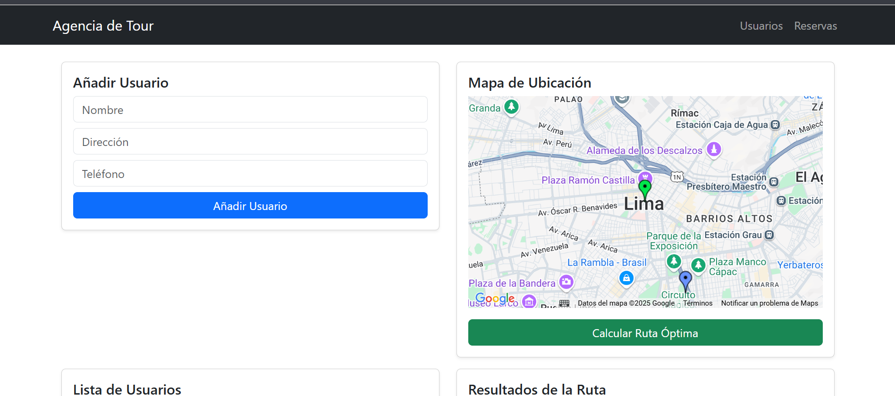

# 🚌 Rutas Turísticas - Optimización de Recorridos  

Este proyecto es una aplicación web desarrollada con **Laravel, JavaScript y Bootstrap**, que permite agregar turistas, visualizar sus ubicaciones en un mapa y calcular la **ruta óptima** de recogida utilizando la **API de Google Maps**.  

## 📌 Características  
✅ Agregar turistas con dirección y número de teléfono.  
✅ Autocompletado de direcciones con **Google Places API**.  
✅ Mostrar en un mapa todas las ubicaciones registradas.  
✅ Calcular la **ruta óptima** de recogida desde el **Centro de Lima** hasta el **Parque de las Aguas**.  
✅ Listar la distancia y tiempo estimado de viaje para cada punto de la ruta.  
✅ Eliminar turistas fácilmente desde la interfaz.  

---

## 🚀 Instalación y Configuración  

### 1️⃣ Clonar el repositorio  
```bash
git clone https://github.com/corpusp/Caso1.git
cd Caso1
```
2️⃣ Instalar dependencias
```bash
composer install
npm install
```

### 3️⃣ Configurar variables de entorno  
Renombra el archivo `.env.example` a `.env` y configura los siguientes valores:  

```ini
APP_NAME="Rutas Turísticas"
APP_URL=http://localhost

DB_CONNECTION=mysql
DB_HOST=127.0.0.1
DB_PORT=3306
DB_DATABASE=nombre_de_tu_base_de_datos
DB_USERNAME=tu_usuario
DB_PASSWORD=tu_contraseña

GOOGLE_MAPS_API_KEY=TU_API_KEY

```

4️⃣ Generar clave de aplicación y migrar la base de datos
bash
Copiar
Editar
php artisan key:generate
php artisan migrate --seed
5️⃣ Ejecutar el servidor
bash
Copiar
Editar
php artisan serve
Abre tu navegador en http://127.0.0.1:8000 🚀

## 🗺️ Uso de la Aplicación  

1️⃣ Añade turistas con nombre, dirección y teléfono.  

2️⃣ Usa el buscador de direcciones para autocompletar la ubicación.  

3️⃣ Visualiza las ubicaciones en el mapa.  

4️⃣ Presiona el botón **"Calcular Ruta Óptima"** para obtener el mejor recorrido.  

5️⃣ La ruta se mostrará en el mapa con detalles de distancia y tiempo estimado.  

## 🌍 Enlace a la Aplicación  
🔗 **URL de la aplicación en producción:** [caso1-production.up.railway.app](https://caso1-production.up.railway.app)  

### 📸 Captura de pantalla  



## 🛠️ Tecnologías Utilizadas
Laravel - Framework PHP para el backend

JavaScript - Para interacción con la API de Google Maps

Bootstrap - Para el diseño de la interfaz

MySQL - Base de datos para almacenar usuarios y ubicaciones

Google Maps API - Para el cálculo de rutas y autocompletado

## 📜 Licencia
Este proyecto está bajo la licencia MIT. Puedes usarlo y modificarlo libremente.

## 👨‍💻 Desarrollador
📌 Christopher Corpus

📧 Contacto: corpusdiazc@gmail.com

🔗 GitHub: github.com/corpusp
